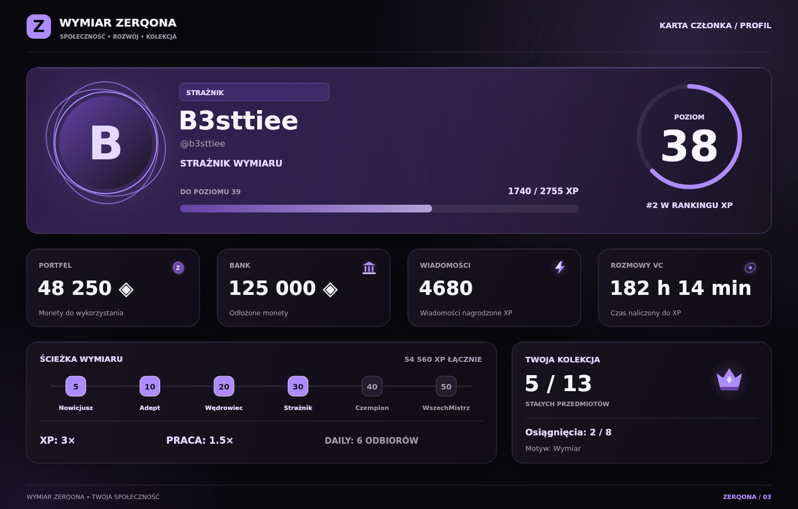

# Wymiar ZERQONA — Community Bot 3.0

Bot Discord z 51 komendami, kartami PNG, poziomami, ekonomią, moderacją, logami i tymczasowymi pokojami głosowymi. Stylistyka: czerń, biel i fiolet. Dane są zapisywane w SQLite.

**Uruchomienie i aktualizacja: [START_TUTAJ.md](START_TUTAJ.md). Pełny katalog komend: [KOMENDY.md](KOMENDY.md). Zmiany: [ZMIANY.md](ZMIANY.md).**

## Karty i obsługa



- Profil, ranga, portfel, sklep, plecak, bank, osiągnięcia, powitanie i sześć rodzajów rankingu. Nazwy są dopasowywane do dostępnego miejsca; awatary mają pamięć podręczną i zastępczy inicjał.
- Przyciski przełączania Profil / Ranga / Portfel, strony rankingu, menu pomocy i interaktywny sklep.
- Pomoc pokazuje wszystkie komendy i wymagane role; zablokowane funkcje są oznaczone kłódką. `/pomoc komenda:nazwa` wyjaśnia parametry i zasady.
- Karty, rankingi, `/userinfo` i `/avatar` mają parametr `prywatnie:true`. Nagrody, sklep, plecak, bank, osiągnięcia, przelewy, historia i poprawnie wykonane komendy administracji są prywatne. **Próba użycia komendy bez wymaganej roli daje publiczną wiadomość z oznaczeniem wyłącznie wykonawcy oraz nazwą wymaganego dostępu.**
- Przyciski obsługuje autor panelu. Panel można ponownie otworzyć komendą, bez czekania na usunięcie poprzedniego.

## Wymagania i start

Node.js 24 (minimum 24.17.0), npm oraz dostęp do Discord API. Zależności instaluje `npm ci`; natywne paczki canvas i SQLite są dobierane dla systemu, na którym wykonywana jest instalacja. Paczka nie zawiera `node_modules`.

```bash
npm ci
npm start
```

Przed startem uzupełnij `.env` na podstawie `.env.example`. Włącz **Server Members Intent** i **Message Content Intent** w ustawieniach bota. Zaproś go z zakresami `bot` oraz `applications.commands`.

Uprawnienia bota: **View Channels, Send Messages, Embed Links, Attach Files, Read Message History, Add Reactions, Manage Channels, Move Members, Manage Roles, Moderate Members, Kick Members, Ban Members, Manage Messages, View Audit Log, Connect**. Umieść rolę bota ponad rolami poziomowymi i użytkownikami, którymi ma zarządzać. Nadpisania uprawnień kanałów nadal obowiązują.

Dla Railway: pozostaw `Dockerfile`, ustaw `DISCORD_TOKEN` i `GUILD_ID`, dodaj trwały Volume pod `/data`. Bot używa `RAILWAY_VOLUME_MOUNT_PATH`, a bez Volume zatrzymuje start, aby nie utracić danych. `CLIENT_ID` jest potrzebny do ręcznego `npm run deploy`. Jedna usługa, jedna instancja bota, jeden wolumin.

## Konfiguracja serwera

Istniejące identyfikatory zachowano w `src/config.js`.

| Funkcja | ID kanału |
| --- | --- |
| Ogłoszenia poziomów | `1516768963814490179` |
| Lobby tworzenia pokoju VC | `1516765981244915825` |
| Log edycji i usuwania wiadomości | `1517117542223839353` |
| Log przejść głosowych | `1517117569566507029` |
| Log kont i profili | `1517117609617915934` |
| Log zmian i administracji | `1517117642794602516` |

| Dostęp | Rola | ID |
| --- | --- | --- |
| Szef | Szef nad wszystkimi | `1515440522225913926` |
| Konto bota | Arcymistrz | `1516499741368647690` |
| Moderator | Namiestnik | `1516499895434088508` |
| Helper | Strażnik | `1526998317014323221` |
| Bonus 2× XP | Booster | `1515748354426933269` |

| Poziom | Rola | ID |
| ---: | --- | --- |
| 5 | Nowicjusz | `1516500127433621504` |
| 10 | Adept | `1516502881115836528` |
| 20 | Wędrowiec | `1516499892154007562` |
| 30 | Strażnik | `1516503624946286754` |
| 40 | Czempion | `1516503622337171456` |
| 50 | WszechMistrz | `1516503826599903384` |

Bot nadaje najwyższą osiągniętą rolę. Rola poziomowa Strażnik i rola administracyjna Strażnik mają różne ID. Uprawnienia ekipy wynikają z ID; rola Arcymistrz służy kontu bota i nie uprawnia użytkowników do moderacji.

Kanał awansów nie ogranicza miejsca zdobywania XP. `XP_CHANNEL_IDS=id1,id2` i `VC_XP_CHANNEL_IDS=id1,id2` umożliwiają takie ograniczenie. Puste wartości oznaczają wszystkie dozwolone kanały.

## XP i ekonomia

- Tekst: 12–18 XP, odstęp 45 sekund, minimum 3 znaki. Powtórzenie ostatniej nagrodzonej treści w ciągu 5 minut jest pomijane. Licznik wiadomości obejmuje nagrodzone wiadomości.
- VC: 8 XP za pełną minutę naliczonego czasu, minimum 2 osoby niebędące botami i nieogłuszone. Lobby, AFK i Stage nie naliczają XP. Czas rozliczany jest przy zmianach stanu i co minutę; czas wyłączenia bota nie jest odtwarzany. Przy przeciążeniu pojedynczy interwał jest ograniczony do 75 sekund.
- Progi: `60 × poziom + 35 × poziom²`. Booster daje 2×, Iskra 1,5× (łącznie 3×), Przebudzenie 2× (łącznie 4×). Rola oraz aktywny boost są sprawdzane w chwili rozliczenia interwału.
- Naturalny pierwszy awans daje `75 × nowy poziom` monet. Korekty `/xp` nie wypłacają monet. Najwyższy rozliczony poziom zapobiega powtarzaniu nagród po cofnięciu XP.
- `/daily`: 350 monet co 24 h. Każdy kolejny odbiór do 48 h dodaje 50, maksymalnie 650 od 7. odbioru. Ponad 48 h resetuje serię. Terminy liczone są od poprzedniego odbioru, a nie od północy.
- `/praca`: 100–240 monet co 45 min. `/nagrody` pokazuje oba terminy.
- Przelewy bez prowizji, transakcje atomowe. Salda i XP muszą być całkowite i nieujemne, limit całego majątku (portfel + bank) wynosi 1 000 000 000 000 monet; XP ma osobny taki sam limit.
- Tytuły, motywy i ramki kupujesz raz; nie zużywają się. `/tytul zdejmij` chowa tytuł z profilu. Boosty zużywają się po użyciu. Kolejne sztuki tego samego mnożnika wydłużają czas o czas przedmiotu. Inny mnożnik tego samego efektu jest blokowany, dopóki poprzedni nie wygaśnie; wtedy przedmiot pozostaje w plecaku.
- `/historia` pokazuje 1–15 ostatnich operacji od wersji 2.0. Migracja nie odtwarza historii, której poprzednia wersja nie zapisywała.
- Gry używają wyłącznie wirtualnych monet. `/moneta` ma 50% szans na wypłatę 2×. W `/sloty` para wypłaca 1,5×, trzy symbole 5×, trzy diamenty 8×. Są to całe wypłaty wraz ze stawką; zysk/strata są pokazane osobno.

## Sklep, kolekcja i oszczędności

Sklep zawiera **18 przedmiotów**: 5 wzmocnień, 7 tytułów, 3 motywy oraz 3 ramki. Każdy ma cenę, kategorię, rzadkość, opis, efekt i zasady. Canvas i interaktywne menu pokazują stan Twojej kolekcji. Wybierz kategorię, stronę oraz produkt; zakup i aktywacja są oddzielnymi działaniami.

- XP: Iskra 1,5× / 1 h; Rdzeń 1,5× / 6 h; Przebudzenie 2× / 1 h. Mnożnik roli Booster działa dodatkowo.
- Praca: Kontrakt specjalny 1,5× / 3 h za 120 monet; Kontrakt elity 1,5× / 12 h za 400 monet. Bonus obejmuje tylko `/praca`, nie skraca cooldownu, nie wpływa na daily ani weekly. Wypłata jest zaokrąglana w dół.
- Motywy Ametyst, Obsydian i Zaćmienie zmieniają kolory kart. Ramki Orbita, Kryształ i Korona zmieniają awatar na profilu i randze. Domyślny wygląd przywrócisz przez `/personalizacja reset`.
- `/bank saldo`, `/bank wplac ilosc:500`, `/bank wyplac ilosc:500`: bank bez prowizji i odsetek. Gry, zakupy i przelewy korzystają tylko z portfela; oszczędności trzeba wcześniej wypłacić.
- `/weekly`: 1200 monet co 7 × 24 h. Niezależny od serii daily.
- `/osiagniecia`: 8 osiągnięć za poziomy, wiadomości, VC, serię, kolekcję, pracę i bank. Nagroda każdego osiągnięcia jest jednorazowa i zapisywana w bazie. Postęp pracy pochodzi z historii zapisanej od wersji 2.0. Osiągnięcia poziomów/aktywności/banku biorą pod uwagę aktualne dane. Najlepsza zapisana seria jest zachowywana po przerwaniu daily.
- `/ekonomia` pokazuje portfel, bank, majątek, nagrody i wykres realnych operacji. Wykres używa dni UTC i obejmuje także przelewy, zakupy oraz ruch portfel–bank. Brak operacji oznacza zero. Demo w `previews/` ma wyłącznie przykładowe wartości.

**Opisy komend i produktów nie nadają uprawnień.** Tytuły oraz rzadkość są elementami kolekcji; nie przyznają ról administracji.

## Pokoje i moderacja

Dołączenie do lobby tworzy pokój. Panel obsługuje nazwę, limit, blokadę wejścia, widoczność, zapraszanie, blokowanie, odłączanie, przekazywanie i przejmowanie pokoju. Pusty pokój znika po 30 sekundach; po restarcie trwa ponowne sprawdzenie zapisanych pokoi. `/pokoj` otwiera panel podczas pobytu na kanale.

Helper zarządza ostrzeżeniami i czyszczeniem. Moderator obsługuje timeouty, kick/ban i ustawienia kanału. Szef ma korekty XP, monet, role i diagnostykę. Alias `/mute` oznacza timeout Discord, nie wyciszenie mikrofonu.

`/zamknij` zapisuje ustawienie **Send Messages dla @everyone** w bazie i je blokuje. `/otworz` odtwarza poprzednie `true`, `false` lub dziedziczenie, również po restarcie. Nie nadpisuje osobnych zezwoleń ról i użytkowników. Komendy działają na kanałach tekstowych i ogłoszeniowych.

## Logi

Wszystkie logi mają branding Wymiaru ZERQONA. Snapshoty tekstu są przechowywane przez 7 dni. Treść wiadomości sprzed uruchomienia bota lub spoza snapshotów może być niedostępna. Audyt Discord nie zawsze pozwala ustalić sprawcę usunięcia; bot nie przypisuje go na podstawie samego przypuszczenia. Globalne aktualizacje profili wymagają dostarczenia zdarzenia przez Discord.

## Sprawdzenie projektu

```bash
npm run verify  # składnia, poprawność definicji komend i testy
npm run preview # 14 przykładowych kart PNG
npm run docs    # odśwież KOMENDY.md z katalogu używanego przez /pomoc
npm run deploy # ręczna rejestracja komend na przypisanym serwerze
```

Testy sprawdzają bazę i migrację, nagrody, trwałość tytułów, historię, uprawnienia, panele, XP na VC, PNG i obsługę komend przez atrapy interakcji. Przegląd kart wykonano na wygenerowanych obrazach. Nie wykonano połączenia z rzeczywistym serwerem ani operacji moderacyjnych na Discordzie — w paczce nie ma tokenu.

## Struktura

`src/cards.js` — karty • `src/graphics.js` — wspólne rysowanie i motywy • `src/achievements.js` — definicje osiągnięć • `src/ui.js` — wspólny branding i embedy • `src/command-meta.js` — opisy i pomoc • `src/public-panels.js` — przyciski, menu, autocomplete • `src/commands*.js` — komendy • `src/db.js` — dane i migracja • `src/experience.js` — XP • `src/voice.js` — pokoje • `src/logs.js` — logi • `tests/` — testy • `assets/fonts/` — fonty z licencją • `previews/` — przykłady.

Dokumentacja API wykorzystana przy aktualizacji: [odpowiedzi na interakcje discord.js](https://discordjs.guide/legacy/slash-commands/response-methods), [Application Commands Discord](https://docs.discord.com/developers/interactions/application-commands), [ChatInputCommandInteraction 14.27.0](https://discord.js.org/docs/packages/discord.js/14.27.0/ChatInputCommandInteraction:Class).
